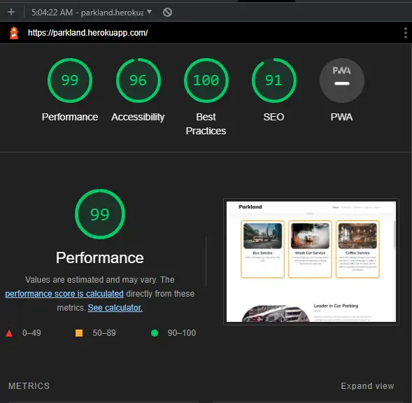
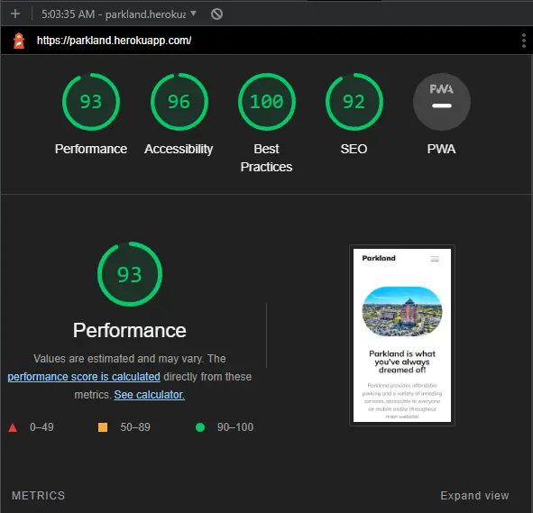
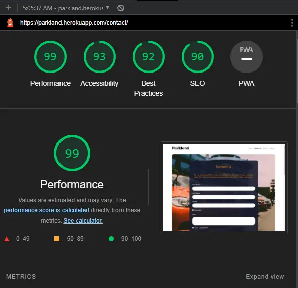
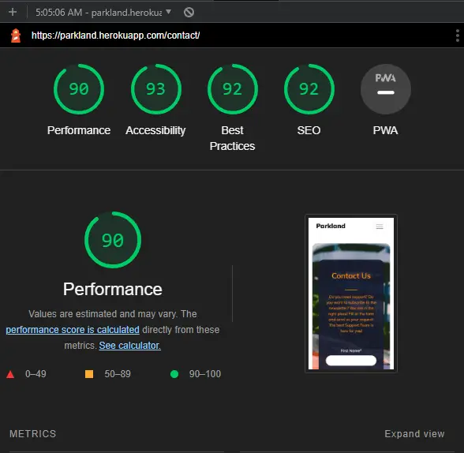
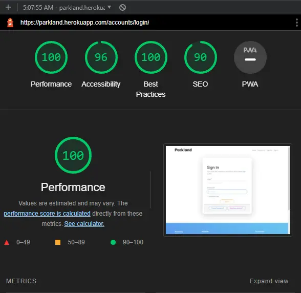

# **Parkland** Website

### **Developer: Claudio Crocilla**

## **Overview**

#### The website offers car parking facilities and more!
#### Who doesn’t like travelling? Experimenting new food and culture, learning new languages, for fun or business, travelling enriches us greatly. Parkland offers the opportunity to start your journey stress-free….NO waiting for a TAXI, NO crowded BUS, NO TRAIN...the customers can reach the airport and park the car in all comforts with extra services (coffee, car wash, 24/7 shuttle services) available just at a fingertips.   
#### The website is intuitive and user-friendly! The users can register to the website with a few easy steps by entering Username and Email and have access to all Parkland great services! The users can also subscribe to a newsletter and receive regular updates as well as provide/review feedback, report issues or request support!

Click in the image above to access the Live Website or [click here!](https://parkland.herokuapp.com/ "Parkland")

## **Project** 

### **User Goal**
- Easy, Intuitive and User-Friendly Website!
- Wide compatibility with every Browsers and Devices.
- A fast, easy and intuitive way to book car parks.
- Time is precious for everyone and we save yours offering a great booking experience.
- High variety of Services offered to the users.
- Possibility to share customer experience via the Dashboard Page.
- Fellow Customer feedback visible to the users in the Home Page.
- Newsletter available to receive updates/offers via email.
- Possibility to report an issue or request assistance/support.

---

## **User Experience (UX)**

### **User Stories**
- #### First Time Visitor Goals
    1. As a First Time visitor of a website dedicated to parking cars, I want to have a visual impact on the Landing Page that will attract my attention.  
    2. As a First Time Visitor, I want to be able to easily navigate through the website.
    3. As a First Time Visitor, I want to be able to see the services offered by the parking website.
    4. As a First Time Visitor, I want to find the website pleasant to the eye, visually intuitive, with catchy colours and images.

- #### Returning Visitor Goals
    1. As a Returning Visitor, I want to be able to register to the website.
    2. As a Returning Visitor, I want to be able to book a parking slot.
    3. As a Returning Visitor, I want to be able to see the prices of the parking.
    4. As a Returning Visitor, I want to be able to report issues.
    5. As a Returning Visitor, I want to be able to request assistance.
    6. As a Returning Visitor, I want to access the website through my social media accounts.

- #### Frequent User Goals
    1. As a Frequent User, I want to see new services.
    2. As a Frequent User, I want to book car slots.
    3. As a Frequent User, I want to be able to change my personal registered information (if necessary).
    4. As frequent User I want to be able to access my personal information via a Dashboard Page.
    5. As a Frequent User, I want to sign up to the Newsletter to receive updates about Parkland.
    6. As a Frequent User, I want to report issues.
    7. As a Frequent User, I want to share a feedback on the website.

<!-- Use Cases Area -->
### **Use Cases**

### *_Home Page_*

    
Description

    
- User can use this website to book parking.
- Users should be able to read the Instructions/FAQ.
- Users should be able to see/access the available services.
- Users should be able to book a parking slot based on type of car (electric vs non-electric cars).
- Users should be able to see other customers feedback.
- The home page also provides information about the history and rational of the website.

    
System & Actors

**System:** Car Parking Website.

**Actors:** User looking for book a parking slot close to the Airport.

    
Pre-Conditions

Users should register into the website to book a parking slot.
Users should register into the website to leave a feedback.

    
Basic Flow

- The user browses for parking facilities close to the airport and discovers the website. The user navigates to the Home Page, and is attracted by the visual impact of the website.
- Users with electric cars will have the possibility to book dedicated spots with electric chargers.
- The user sees the available services.
- The user books a parking slot.

    
Alternative/Exception Flow

- When the user selects a non-existent page, a 404 Error Page will be prompted guiding the user back to Home Page.
- If the user is not logged in, it is not possible to book a parking slot nor leave feedback.

 

### *_Booking Page_*

    
Description

   
- Users can use this website to book a parking slot.
- Users should be able to book a parking slot based on a date range.
- Users should be able to book a parking slot based on the car’s type.
- Users should be able to see a recap of the information of the booking.
- Users should be able to have a double confirmation system for the booking.

    
System & Actors

**System:** Car Parking Website.

**Actors:** Users looking to book a parking slot close to the Airport.

    
Pre-Conditions

Users should register into the website to book a parking slot.

    
Basic Flow

- The user browses for parking close to the airport and discovers the website. The user navigates to the Booking Page of the website, and is attracted by the visual impact of the website.
- The user can select a date range, can choose parking slots depending on the type of owned car (electric/non-electric), select the desired slot and visualise the price.
- The user can review the information entered and confirm the booking.
 

    
Alternative/Exception Flow

- When the user selects a non-existent page, a 404 Error Page will be prompted guiding the user back to Home Page.
- If the user is not logged-in, it is not possible to book a parking slot nor leave feedback.

 

### *_Contact Us_*

    
Description

- Users can subscribe to the newsletter, report issues or request assistance.
- Users can use this page to see the general info of Parkland Company (including Address, Email address, phone, and a map showing Parkland location).

    
System & Actors

**System:** Car Parking Website.

**Actors:** Users who want to report issues, subscribe to a newsletter or request assistance.

    
Pre-Conditions

Users should accept the Terms and Conditions to be able to ask for support/ report issues or for subscribing to the Newsletter.

    
Basic Flow

- The user browses the internet to book a parking space and discovers the website. The user navigates to the Home Page and then goes into the Contact Us Page.
- The user fills the mandatory fields.
- The user must accept the Terms and Conditions to subscribe to the news letter and/or report issues/ request support.
- The user can select the available checkboxes to subscribe for the newsletter.
- The user submits the form.
- The user receives a notification indicating that the form has been submitted successfully.

    
Alternative/Exception Flow

- The user can reset the form.
- When the user selects a non-existent page, a 404 Error Page will be prompted guiding the user back to Home Page.

 

### *_Dashboard_*

    
Description

- Users can access the Dashboard page only when they are signed in.
- Users can access a number of services divided into separate subpages listed as follow:

1. My Parkland: to access active/past bookings, rewards, to review registered cars and/or be redirected to the feedback subpage (see point 4).
2. My Profile: to create or edit their personal profile, change their passwords, register a new car and/or list/delete previously registered cars.
3. My Bookings: to visualise a list of active/past bookings.
4. My Feedback: to visualise past or add new feedback. Once signed-in the user is presented with the possibility to delete/edit past feedback.

    
System & Actors

**System:** Car Parking Website.

**Actors:** Users that want to access past/present bookings, rewards, edit or create their profile (including car registration) and/or provide/review feedback.

    
Pre-Conditions

User should register into the website to access the page.

    
Basic Flow

- The user browses for parking and discovers the website. The user sign into the website and navigates to the Dashboard Page. The user is presented with a list of possible options to access the bookings/ the feedback or their profile page.
- The user clicks into the desired subpage.
- The user is able to perform a list of desired actions of choice.

    
Alternative/Exception Flow

- When the user selects a non-existent page, a 404 Error Page will be prompted guiding the user back to Home Page.

 

### *_Sign In/ Sign UP_*

    
Description

- Users can subscribe to the website.
- Users can sign-in to the website.

    
System & Actors

**System:** Car Parking Website.

**Actors:** Users who want to register/sign-in to the website.

    
Pre-Conditions

Users should be willing to register to the website.

    
Basic Flow

- The user browses the internet to book a parking space and discovers the website. The user navigates to the Home Page and then goes into the Sign Up Page.
- Users subscribe to the website by filling the mandatory fields.
- Users will receive a confirmation email to their address.
- Users verify the provided email address.
- Users sign-in with the chosen username/email and passwords.

    
Alternative/Exception Flow

- The users can click on the Forgot Password Button if they are not able to sign in.
- The users can click to the Need an Account Button if they need to register.
- When the user selects a non-existent page, a 404 Error Page will be prompted guiding the user back to Home Page.

---

## **Design**

#### The webpage has been designed to provide a simple, interactive and intuitive view which is able to offer a pleasant experience to customers looking to book a car park.
#### Every page has a minimalistic structure which however contains all the relevant features in order to provide the user with an interactive, clear and effective experience.  

- ### **Colour Scheme**
#### The goal is to use a colour palette that will provide the user with a good and positive impact at a first glance, when opening the website and through the entire navigation experience.
#### The list of colors is chosen to be pleasing to the eyes providing an excellent contrast that will allow the user to have prolonged navigation hours without tiring the eyes.

Colour Source: 
  - #### [Adobe Color](https://color.adobe.com/create/color-wheel)
  - #### [Color Hunt](https://colorhunt.co/) 
#### The main colors are Navy (#181D31), White (#XXXX) and Black for text and background, Cyan (#181D31) with Text White (#XXXX) for the feedback, Orange (#XXXX) and Navy (#181D31) for the cards/ Booking Page.
#### Navy (#181D31) it has also been used for the background in the Booking and Contact us Forms. These colors are chosen to highlight different components and to make a good contrast providing a better view of those components.
 

- ### **Typography**
#### Google Fonts has been used to select the fonts for the Website.
#### The Main fonts used is: 'Mulish' while the Sans-serif has been set up as fall-back in case the main font is not loaded.

Source:
  - [Google Fonts](https://fonts.google.com/)

- ### **Images and Videos**
#### Real and effective images have been used to provide a pleasant visual experience to the user.
#### The developer selected those images from the following source to mimic a full immersive car related content.

Sources:  
  - [Pexels](https://www.pexels.com/)

--- 

## **Features**
- ### *__Structure__*:
The website has been structured in an easy and user-friendly way with 6 main pages. Non-authenticated and authenticated customers are provided with two different page views. The Non-authenticated can visualise and access only the Home Page, Contact Us, Sign-In and Sign-Up pages, while the authenticated customers are also able to access the Booking and the Dashboard pages.
The Structure of the website and the components used are listed below:

- ### *__Home Page__*:
#### The Home Page shows the logo of the website on the top left and a navigation bar on the top right of the page.
#### A small underline animation activates when the user mouse hovers on of the elements in the nav bar, highlighting the content.
#### The active page is in Bold in the navigation bar when selected.
#### Depending on the device used (if laptop, desktop, tablet or smartphone) the position of the nav bar changes, creating a hamburger menu that will be displayed on the top right part of the page to adapt the view for a highly responsive rendering.
#### Those behaviour are consistent in all pages.
#### Following from Logo and the nav bar the user will see a brief description of the website associated with an image on the right side.
#### The Services Section shows all the services offered (Car Wash, Coffee, Bus Services)
#### The Booking Section is under the Services Section and offer the possibility to register to the website for non-authenticated user or be redirected into the Booking Page for authenticated users.
#### This is obtained by using a Django Tag with an if else statement to differentiate the content depending on the type of user (non-authenticated vs authenticated).
#### The Feedback Section shows the latest 3 feedbacks provided by other users.
#### The Latest Update Section shows new info about the company or new added services.
#### The Footer section concludes the Home Page, allowing the users to select the different sections of the website or to access Parkland social media with one click.
#### The Footer section changes depending on the Pages selected (Home vs other Pages): a Django Tag and an if else statement show/hide the Services and Feedback Sections in the footer.

- ### *__Contact Us Page__*:
#### This page has Header and Footer consistent with the Home Page.
#### The page is characterized by an image extended as background on top of which there is a form that the user can fill with the following information: First, Last Name, Email Address and a Checkbox that will allow the user to subscribe to a ‘Dummy’ newsletter.
#### The user needs to accept the Terms & Conditions Check box to being able to move forward.
#### A Reset and a Submit buttons are included.
#### The Reset Button resets the form.
#### The user will be redirected to the same page and a notification is displayed informing the user that the request has been submitted successfully.
#### Following the form, the page shows a map with Parkland’s location and details (Company Name, Address, Email, Phone Number and Opening Hours). Hoovering the mouse over the company information boxes a small animation highlights the hoovered icon for an effective visual impact.

- ### *__Sign Up/Sign In Page and Authentication Process__*:
#### This page has Header and Footer consistent with the Home Page.
#### The authentication module used for Parkland is Allauth (a set of Django applications dealing with account authentication, registration, management, and third-party (social) account authentication) add link.
#### The pages have been directly imported from Allauth and customized for the needs of Parkland.   

#### In the Sign Up Page, there is a form that the user can fill with the following information: Email Address (with confirmation), Username and Password (with confirmation).
#### A Reset and a Sign Up buttons are included.
#### The Reset Button resets the form.
#### By clicking on the Sign Up Button (if all mandatory fields have been filled-in correctly) the user will be redirected to the verification email page and a real email is sent to the user requesting validation. The user is not allowed to sign-in in parkland until the verification is completed.
#### If the form is not filled-in correctly, a message appears to the user to request to fill-in the information correctly.

#### In the Sign In Page, there is a form that the user can fill with the following information: Email Address (or Username) and Password.
#### A Sign in and a Forgot Password are included.
#### When clicking on Forgot Password the user is redirected to a Password reset form, where the user is prompted to insert the email address to receive an email with the new password.
#### By clicking on the Sign In Button (if all mandatory fields have been filled-in correctly) the user will be redirected to the Homepage.
#### If the form is not filled in correctly, the user is not able to access the web pages.

- ### *__Booking Page__*:
#### This page has Header and Footer consistent with the Home Page.
#### Only Authenticated Users can access the Booking page.
#### The Booking process is composed of 3 pages, by clinking on the dedicated page of the nav bar, the user is redirected to first booking page.
#### In here, the user needs to indicate the arrival and the departure dates (Start and End Date) and click on Recharger Electric Car if they need to book a parking slot dedicated to electric cars.
#### The database will be queried for available parking slot in the selected dates showing only electric cars and dedicated parking slots if the Recharger Electric Car filter is selected.
#### The users, redirected to the second page, or Car and Parking Selection Page, need to select the pre-filled car registration number (the price charge will be auto populated), and one of the available parking slot.
#### The car registration number is stored into the database, populated by the user when registering to the website (car registration is a mandatory field). The drop-down car registration is obtained with a database query per user.
#### When clinking on Book a pop-up will ask the users if they want to keep going and confirm the booking, once doing so the third page of the booking system is open and the users are provided with a recap of the booking info in the UI.

- ### *__Dashboard__*:
#### The Dashboard has been structured in an easy and user-friendly way with 8 main pages divided in 4 Sections (My Parkland, My Profile, My Bookings, My Feedback).
#### The Dashboard shows the logo of the website on the top left and a Hamburger Menu that toggles the opening and closing of a side nav bar.
#### All the forms have been realized with Crispy Forms of Django and Crispy bootstrapp (For Details please visit the link: https://pypi.org/project/crispy-bootstrap5/)
#### The Dashboard shows also the Logout Button on the top right allowing the user to easily exit the website.
 
#### Depending on the device used (laptop, desktop, tablet or smartphone) the sidebar opens and closes automatically allowing the user to select different options from the hamburger menu and/or have a full visual of the page for a highly responsive rendering.
#### Those behaviours are consistent in all sections of Dashboard.
#### The Logo and the Sidebar are consistent in all sections.

#### All Dashboard's Sections listed below (Open the accordion for more information): 

    
My Parkland

#### My Parkland summarises in just one page-view and with different cards all user’s information allowing to access Bookings, Registered Cars, Rewards points and provided Feedback. A link “View Details” is present in each card and will redirect the users to the selected list.

#### The Function .count() has been used in this section to retrieve the total number of the selected items.
#### A Reward Card displays the Customer Points earned depending on the quantity of Bookings (100 points per booking).

#### “My Parkland” also includes a Message Center realized using Django messages where all content (like Sign In, Sign Out of the user) is displayed.

    
My Profile

#### “My Profile” is composed of 4 main sub-section (Edit Profile, Change Password, Add Cars, Cars List) realized using class base views. In Edit Profile (realized using a UpdateView), the users can edit their own profile changing Username, First and Last Name, Email Address and Deactivate the Account (by unchecking the “Account Active” Checkbox).

#### The user can change the password using the “Change Password” Page. This has been realized using the PasswordChangeView and PasswordChangeForm provided by Django auth views/forms. The pages have been customized to match the color schema and layout of Parkland.

#### Through “Add Cars” (realized using a CreateView) the users can register a new car and review all the registered cars (Cars List).
#### Accessing Cars List triggers a query to the Cars’ database table, filtering and displaying only the cars of the logged-in user.

#### The users can also delete the registered cars (the deletion page is realized using a DeleteView). A pop-up is displayed to request user confirmation. In addition, the message highlights the fact that by deleting the cars, the associated bookings will also be deleted.

   
My Bookings

#### “My Booking” includes the Booking List Page where all the bookings made by the user are listed. In order to realize this page a ListView has been used. Accessing Booking List triggers a queries to the Booking’s database table, filtering and displaying only the bookings of the logged-in user.

#### Similarly to other pages, single booking information are summarised in cards. Each card includes the possibility to review the details of the booking using a dedicated Details Button, or delete all information, using Delete (in this case, a pop-up requests users’ confirmation).

   
My Feedback

#### “My Feedback” includes 2 sub-section (Add Feedback and Feedback List).
#### The subsections are consistent in colors and layout with the Sections described above.

#### Add Feedback (realized using a CreateView) allows the user to leave a Feedback to Parkland.
#### The latest 3 feedback added are displayed in the Homepage.

#### In order to realize a better visual impact feedback page a combination between the forms provided by Django and a custom form has been used where each feedback can be rated with a star system (from 1 to 5) for easy-to-use and effective view.
#### In the Feedback List for a consistent display setting through the website, the logged-in user feedback are shown in cards.

#### The Feedback List has been realized using a ListView. The user can review all information as well as Edit or Delete using dedicated buttons.
#### Consistently with all other pages deleting a feedback triggers a pop-up message requesting user’s confirmation.

- ### *__404 Error Page__*:
#### For any broken or incorrect links, the 404 Error page will be triggered. Here the user will have an image displayed in the background and above text box that will inform the users that the page is not correct.
#### A button is present in the text displayed and highlighted in cyan in order to allow the user to navigate back to the Home Page.  

---

## **Wireframe**
#### Balsamiq has been used in order to create the wireframe.
#### Below you can open the accordions divided by page and by device used (desktop, tablet and smartphone).

- ## Home Page 

    
Home Page Wireframes
 

    
Click here for Desktop View
  

    
Click here for Tablet View

    
Click here for Smartphone View

- ## Booking Page

    
Booking Page Wireframes
 

    
Click here for Desktop View

    
Click here for Tablet View

    
Click here for Smartphone View

- ## Contact Us Page

    
Contact Us Page Wireframes

    
Click here for Desktop View

    
Click here for Tablet View

    
Click here for Smartphone View

- ## Thanks You Page

    
Click here for Desktop View

    
Click here for Tablet View

    
Click here for Smartphone View

- ## 404 Error Page

    
Click here for Desktop View

    
Click here for Tablet View

    
Click here for Smartphone View

---

## **Technologies Used**

- ### **Languages**

#### The Languages used are:
 - HTML5
 - CSS3
 - JAVASCRIPT
 - PYTHON

#### Only custom HTML, CSS, JavaScript, Python Code has been used.

- ### **Frameworks, Libraries & Programs Used** 

#### Django Framework has been used.

- #### Google Fonts: 
    - #### Google fonts were used to import the font into the style.css file which is used on all pages throughout the project.

- #### Font Awesome:
    - #### Font Awesome was used on all pages throughout the website to add icons for aesthetic and UX purposes.

- #### Git: 
    - #### Git was used for version control by utilizing the Gitpod terminal to commit to Git and Push to GitHub.

- #### GitHub: 
    - #### GitHub is used to store the projects code after being pushed from Git.

- #### Balsamiq: 
    - #### Balsamiq was used to create the wireframes during the design process.

- #### TinyPNG
    - #### TinyPNG has been used to compress images.

- #### Convertio
    - #### Convertio has been used to convert the images in webp exxtension.

- #### Heroku
    - #### Heroku is a platform as a service (PaaS) and it has been used to run the Parkland website application entirely on the cloud.

- #### Wondershare EdrawMax:
    - #### Wondershare EdrawMax has been used to create the Database Schema for the website.

- #### Microsoft Whiteboard:
    - #### This is an infinite, collaborative canvas for effective meetings and engaging learning. Whiteboard was used to summarise the programming steps, the layout and the rationale behind those. Whiteboard has been used together with the Wondershare EdrawMax.

---
## **Testing**
The testing phases have been carried out using the **PIP8 Python Validator**. No errors have been identified from the Validators as can be seen in the screenshots below:

The testing phases have been also carried out using the **W3C Javascript Validator**, **W3C CSS Validator** and **W3C Markup Validator**(in all pages). No errors have been identified from the Validators as can be seen in the screenshot below: 

- **JavaScript**

    
Click here for W3C Javascript Validator

- **CSS**

    
Click here for W3C CSS Validator

    
Click here for W3C CSS Validator - Warning

- **HTML**

    
Click here for W3C Markup Validator - Home Page

    
Click here for W3C Markup Validator - Parking Page

    
Click here for W3C Markup Validator - Contact Us

    
Click here for W3C Markup Validator - Sign In/Sign Up

    
Click here for W3C Markup Validator - Thank You

    
Click here for W3C Markup Validator - Error 404

- ### **Lighthouse Validator**
Below it is possible to taka e look at the result obtained in Lighthouse:

    
Click here for for Lighthouse Desktop - Homepage

    
Click here for for Lighthouse Mobile - Homepage

    
Click here for for Lighthouse Desktop - Contact Us

    
Click here for for Lighthouse Mobile - Contact Us

    
Click here for for Lighthouse Desktop - Sign In

    
Click here for for Lighthouse Mobile - Sign In

    
Click here for for Lighthouse Desktop - Error 404

    
Click here for for Lighthouse Mobile - Error 404

- ### **Test Cases**

- #### List of Manual Test Cases perfomed. 
All the Tests have also been performed in all the Devices and the tests includes also Layout testing. 

| Page | Feature | Expected Result | Status |
| --- | --- | --- | --- |
| Home | Header | Make sure that the Logo and the nav bar are displayed on the top part of the Home Page. | Example: Pass |
| Home | Header | Make sure that non authenticated users can only access Home, Contact Us, Sign In/Up Pages. |  |
| Home | Header | Make sure that authenticated user can see/access Home, Booking, Contact Us, My Parkland Dashboard. |  |
| Home | Header | Make sure that by clicking on the Logo the user is redirected to the Home Page. |  |
| Home | Parkland Section | Make sure that the Image of Parkland is displayed with no overlap with the Logos, Nav Bar and/or text. |  |
| Home | Parkland Section | Make sure that the Image of Parkland is displayed on the right and does not overlap with the Text Description on the left. |  |
| Home | Service Section | Make sure that the Services are displayed with Image on top and text is centered. |  |
| Home | Services Section | Make sure that only 3 cards are displayed with no overlap between the images and the text included into the cards. |  |
| Home | Story Section | Make sure that the Image is displayed with no overlap with other sections. |  |
| Home | Story Section | Make sure that the Image is displayed on the left side while the text is on the right. |  |
| Home | Booking Section | Make sure that the Image is displayed with no overlap with other sections. |  |
| Home | Booking Section | Make sure that the Image is displayed on the right while the text is on the left. |  |
| Home | Booking Section | Make sure that a non authenticated user has the possibility to Sign in and Sign up. |  |
| Home | Booking Section | Make sure that an Authenticated User can see the Booking button to access the Booking Page. |  |
| Home | Feedback Section | Make sure that the feedback area displays a carousel with Users’ Feedback.|  |
| Home | Feedback Section | Make sure that the user can use the arrows to switch between feedbacks. |  |
| Home | Updates Section | Make sure that the cards with the company updates are displayed correctly.|  |
| Home | Footer | Make sure that the footer displays the information of the company |  |
| Home | Footer | Make sure that the footer provides the link to access the social media and when clicking on the icons a new tab is opened |  |
| Home | Footer | Make sure that the user can sign up with an email address to receive the newsletter.|  |
| Home | Footer | Make sure that by clicking on the newsletter form button if no email or an invalid email has been entered an error message is displayed to the user. |  |
| Home | Footer | Make sure that by clicking on the newsletter form button if correct email has been entered a success message notification is displayed to the user |  |
| Contact Us | Images | Make sure that the background image is displayed correctly. |  |
| Contact Us | Form | Make sure all the fields (First Name, Last Name, Email, Text) are editable. |  |
| Contact Us | Form | Make sure all the checkboxes (Newsletter and Terms & Condition) are clickable. |  |
| Contact Us | Form | Make sure all the fields (First Name, Last Name, Email, Text, Terms & Condition) are mandatory. |  |
| Contact Us | Form | Make sure that the Reset Form Button works and deletes all the information entered in the form. |  |
| Contact Us | Form | Make sure that the Submit Button works and provides a clear message to the user. |  |
| Booking| Page | Make sure that only authenticated user can access and view the content of the Booking Page. |  |
| Booking | Images | Make sure that the background image is displayed correctly. |  |
| Booking | Search Form | Make sure all the fields (Start and End Date) are editable and mandatory. |  |
| Booking | Search Form | Make sure that the user cannot submit the form if the Start Date is greater than the End Date. |  |
| Booking | Search Form | Make sure that the user cannot submit the form if the Start Date is less or equal to the current day. |  |
| Booking | Search Form | Make sure that the Search Button works and redirects the user to the Booking Area. |  |
| Booking | Booking Form | Make sure that the Start and End date are in read-only mode. |  |
| Booking | Booking Form | Make sure that the all the fields (Cars, Parking Slot) are editable. |  |
| Booking | Booking Form | Make sure that the Car field is a Dropdown displaying only the logged-in user’s cars. |  |
| Booking | Booking Form | Make sure that the Parking field is a Dropdown that display only the available Parking Slots. |  |
| Booking | Booking Form | Make sure that the Parking and Cars are filtered based on the search made by the user. |  |
| Booking |Booking Form | Make sure that the price information is auto populated depending on the number of days selected. ||
| Booking | Booking Form | Make sure that by clicking on the Book Button a modal is opened requesting confirmation to the user. |  |
| Booking | Booking Form | Make sure that if the form is filled-in correctly and after submission, the user is redirected to the Recap Page. |  |
| Booking | Recap Page | Make sure that the booking summary information is displayed in the page. ||
| Dashboard | My Parkland | Make sure that only authenticated user can access and view the content of the My Parkland Page. |  |
| Dashboard | My Parkland | Make sure that Booking, Cars, Feedback and Rewards Cards are displayed correctly. |  |
| Dashboard | My Parkland | Make sure that the correct value of Bookings, Cars, Feedback and Rewards is displayed in each card. |  |
| Dashboard | My Parkland | Make sure that the from the cards it is possible to access the lists of Bookings, Cars and Feedback. |  |
| Dashboard | My Parkland | Make sure that the any available message is displayed correctly under the messages center.  |  |
| Dashboard | My Profile | Make sure that the My Profile Section includes the Edit Profile, Change Password, Add Cars and Cars List Sub-Sections. |  |
| My Profile | Edit Profile | Make sure that by clicking Edit Profile the user is able to access the personal information form. |  |
| My Profile | Edit Profile | Make sure that in the Edit Profile Form the user can edit only his/her own personal information. |  |
| My Profile | Change Password | Make sure that by clicking Change Password Sub-Section the user is able to successfully access the Change Password Page. |  |
| My Profile | Change Password | Make sure that in the Change Password Form the user can change the password associated to his/her account. |  |
| My Profile | Add Car | Make sure that by clicking Add Car the user is able to access the Add Car Page form. |  |
| My Profile | Add Car | Make sure that filling-in the form, if the form is valid, the user is redirected to the Car List Page after submitting the form. |  |
| My Profile | Add Car | Make sure that the user is obliged to fill the mandatory fields correctly. |  |
| My Profile | Car List | Make sure that by clicking Cars List Sub-Section the user is able to access his/her own personal Car List. |  |
| My Profile | Car List | Make sure that the user can visualise the information of his/her own registered car. |  |
| My Profile | Car List | Make sure that the user can click on the Delete button to delete the registered car. |  |
| My Profile | Car List | Make sure that by clicking on the Delete Button a modal requesting confirmation to the user in opened. |  |
| My Profile | Car List | Make sure that the user is informed that by deleting a car the associated booking will be removed too. |  |
| My Booking | Booking List | Make sure that the by clicking Change Profile Sub-Section the user change the password associated to his/her account. |  |

- #### List of Automated Test Cases perfomed:
8 Automated Tests have been performed in the application. 
The Automation Testing includes Urls Testing and Views Testing. 

### **Additional Tests**
Tests have been performed on Firefox, Microsoft Edge, Chrome and Safari and the result is consistent in all the browsers. 

Additional tests include checks on different devices using the Toggle Device Emulation in Firefox and Microsoft Edge. Below the list of devices used for the tests through the Responsive Design Mode in Firefox is shown:
* iPhone 12 Pro Max
* iPad Pro
* iPad 
* Moto 4G
* Samsung Galaxy S20 Ultra
* Surface Duo

### **Bugs**
- No other bugs could be found in the website during the test phase.

### Future Implementation
- List here the possible future implementation
---

## **Development** 
### Deployment

- ### **Github**
The repository for the project Parkland has been created using Github using the following procedures:
1. Create a Github account [Github.com](https://github.com/)
2. In the top left Github Home Page click on the green New Button in order to create a new repository
3. Select the Template if available (Example: Code-Institute-Org/gitpod-full-template)
4. Choose the Repository name
5. Click on the Create Repository Button in order to create the repository
6. Install the Gitpod Extension in your browser
7. Once Gitpod Extension has been installed, accessing the repository previously created, click on the Gitpod Button
8. A new page will be opened and the Workspace will be created
   

- ### **Heroku App**
Heroku is a platform as a service (PaaS) used to run, operate the Parkland website application entirely in the cloud using the following procedures:
1.	Create an Heroku Account [Heroku.com](https://www.heroku.com/)
2.	In the top right of the “Welcome to Heroku” Screen click on the New drop-down menu
3.	Click on the Create “New App Button”
4.	Select an App Name (Example: Parkland)
5.	Choose the region: “Europe”
6.	Click on the Create App Button
7.	Go in the Settings Tab
8.	In the Config Vars section click on the Reveal Config Vars Button
9.	Enter “PORT” in the Key field, “8000” in the Value field and then press Add
10.	Go in the Buildpacks section and click on the Add Buildpack Button
11.	Select python and press Save Changes
12.	Go in the Deploy Tab 
13.	In the Deployment method section select Github to connect with your repository
14.	In the App connected to Github section type the name of the repository (Example: parkland) and then press Add
15.	Go in the Manual section, select the correct branch and click on Deploy Branch
16.	Click on the View Button as soon as the deploy is finished and you will be redirected to a new page with your application. 

- ### **GitHub Pages**
The project was deployed to GitHub Pages using the following steps:
1.	Log in to GitHub and locate the GitHub Repository created
2.	Click on the Setting Button
3.	On the left menu bar, click on the "Pages" Tab
4.	Under "Source", click the dropdown called "None" and select "Main"
5.	The page will automatically refresh
6.	When the website is disployed, on top of this page you can see the link of the live website 

<!-- Forking Content from Code Institute Readme File Sample -->
- ### **Forking the GitHub Repository**  
By forking the GitHub Repository we make a copy of the original repository on our GitHub account to view and/or make changes without affecting the original repository by using the following steps:
1.	Log in to GitHub and locate the GitHub Repository
2.	At the top of the Repository (not top of page) just above the "Settings" Button on the menu, locate the "Fork" Button
3.	You should now have a copy of the original repository in your GitHub account

- ### **Local Clone**
By creating a Local Clone you will be able to create a copy of the repository that is avilable in your local computer.
In order to create a Local Clone follow the steps below: 
1.	Log in to GitHub and locate the GitHub Repository that you want to clone
2.	Click on the Code Button
3.	To clone the repository using HTTPS, under "Clone with HTTPS", copy the link
4.	Open Git Bash
5.	Change the current working directory to the location where you want the cloned directory to be made
6.	Type git clone as shown in the example below and then paste the URL copied in Step 3
>$ git clone https://github.com/YOUR-USERNAME/YOUR-REPOSITORY
1. Press Enter 
2. Your local clone will be created

---
## **Credits**

Thanks to my Mentor, Narender Singh, for his guide and support in the realization of this project, for his availability and for being willing to talk to me on a Sunday night!!
Thanks to the useful references and suggestions derived from sources listed below, I manage to gain a deeper understanding of how Django works and is used, including the integration with HTML. In addition, continuous trial and error tests provided a useful means to further experiment on the usage of these used programming languages for the creation of the site.

- ### Content & Media
The landing Page of the website was initially realised using a bootstrap template. This Template has been gradually updates to meet the need of the website. A Django framework has been used for the realization of the site.
The content of the application is entirely customised. In order to consolidate the knowledge acquired during the Code Institute Course dedicated to Django (as well as the HTML, CSS and Javascript), I have used the websites listed below studying and focussing on the writing coding procedures and its best practices:
- [Medium.com](https://medium.com/@inceptiondj.info/html-css-coding-best-practice-fadb9870a00f)
- [Learn.shayhowe.com](https://learn.shayhowe.com/html-css/writing-your-best-code/)
ADD LINK HERE
- 
- 
- 

The most complex developing portions of the Parkland Website application were:
-How to make the booking page properly working and the logic associated to it including the filtering on the search page (for Start/End Dates and for Electric Car Recharger) and the interaction between tables into the database to being able to display the correct information
The following website were inspirational and helped me understanding how to structure the logic on the gravity of the coin entered in the table. I have customized and created my own code taking inspiration from:

Listed here additional sources of the studies: 
- [Flexbox - W3School.com](https://www.w3schools.com/css/css3_flexbox.asp)
- [Css-tricks.com](https://css-tricks.com/snippets/css/a-guide-to-flexbox/)
- [Developer.mozilla.org](https://developer.mozilla.org/en-US/docs/Web/CSS/CSS_Flexible_Box_Layout/Basic_Concepts_of_Flexbox)

- [Favicon.io](https://favicon.io/) was used to include the favicon in the website.

For the realization of the 404 error page I found a guide on how to create the file here: 
- [Docs Github](https://docs.github.com/en/pages/getting-started-with-github-pages/creating-a-custom-404-page-for-your-github-pages-site)

Thanks to Kasia Bogucka and Narender Singh for suggesting the use of github wiki site to create the Markdown file. They have also provided the link for the Sample Readme of Code Institute.
- [Sample Readme File - Code Institute](https://github.com/Code-Institute-Solutions/SampleREADME)
- [Markdown - Cheatsheet](https://github.com/adam-p/markdown-here/wiki/Markdown-Cheatsheet)

All the Images as well as the Video included in the Home Page have been taken from [Pexels.com](https://www.pexels.com/)

But most of all thanks to my girlfriend Rosi Davi who is always beside me supporting me in this amazing journey!
Thank you to the entire Code Institute Team and the Slack Community for their feedback, help and support. 

